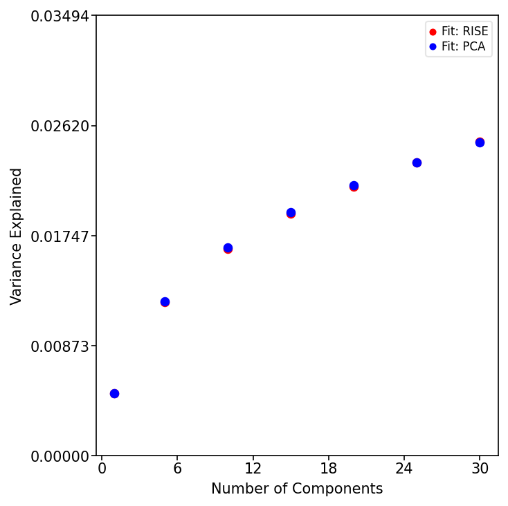
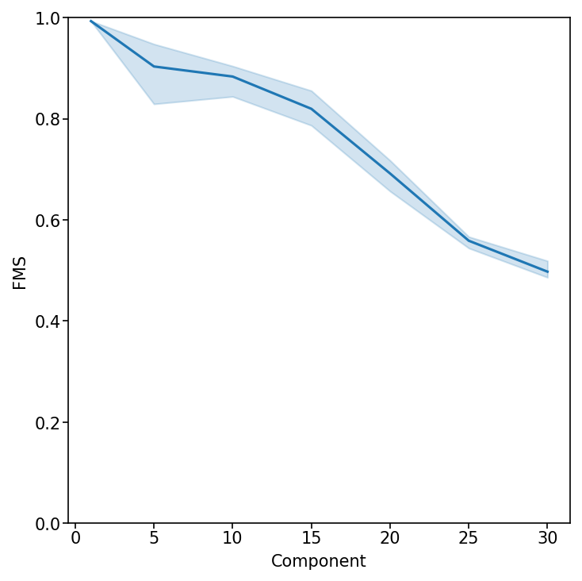
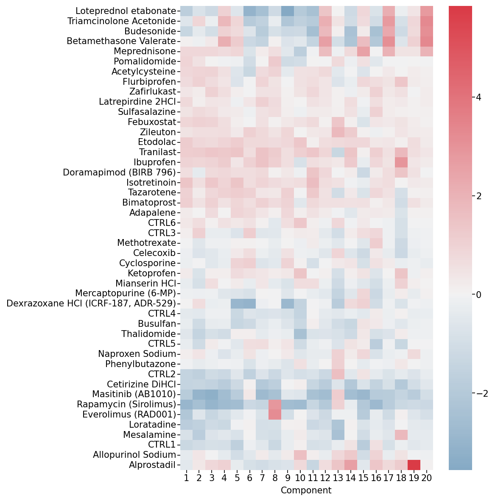
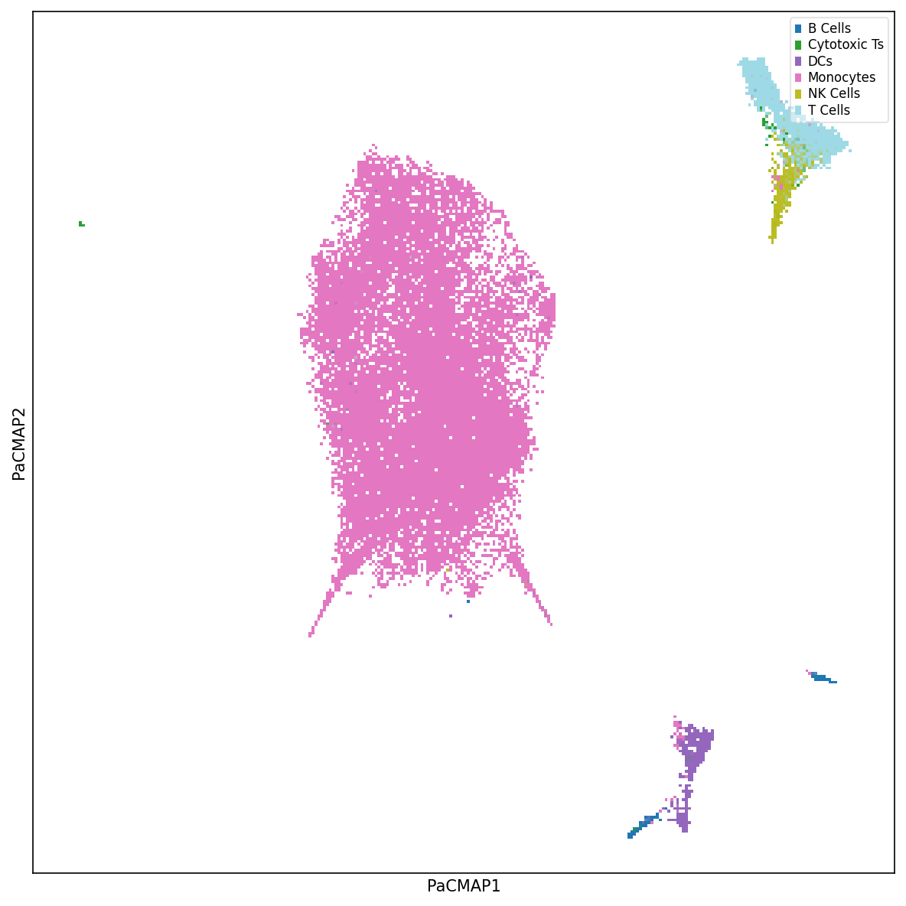
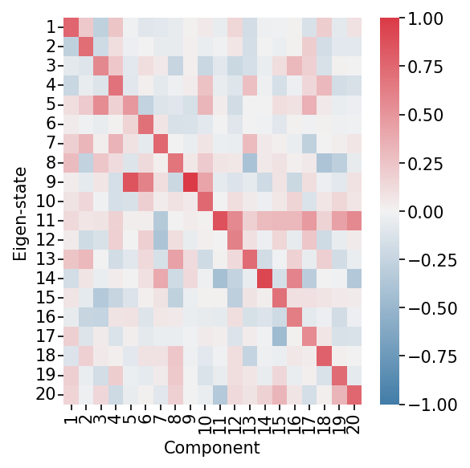
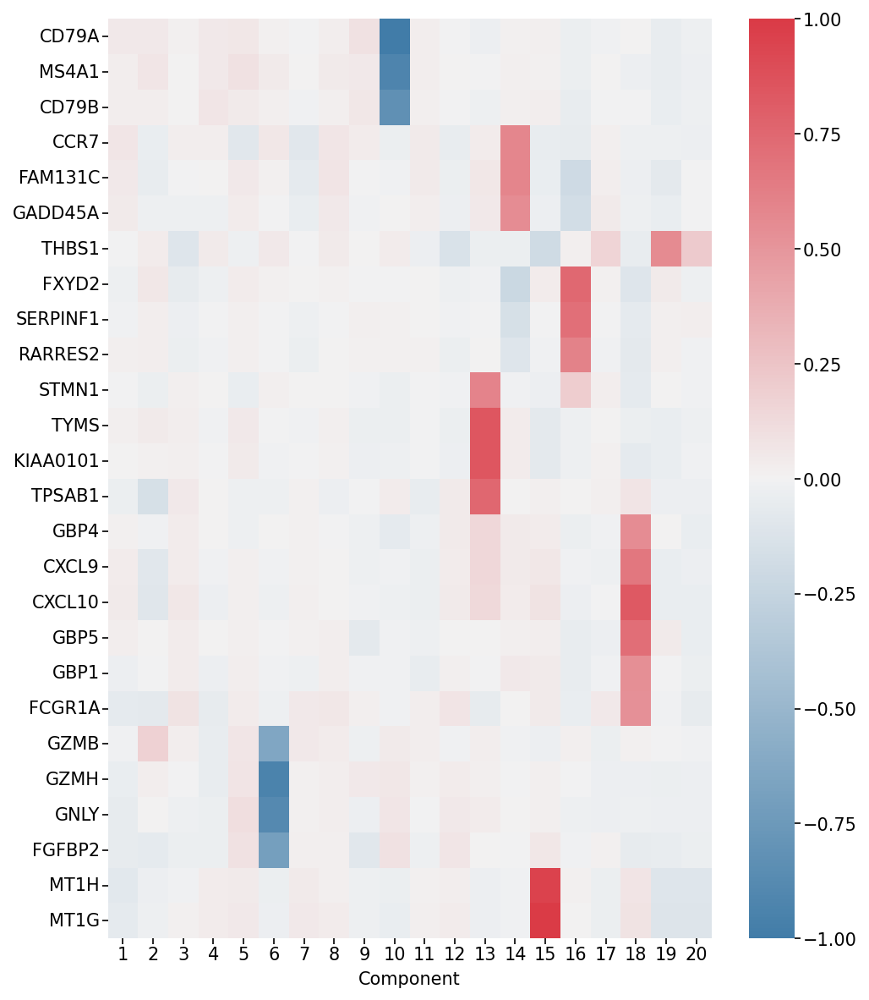
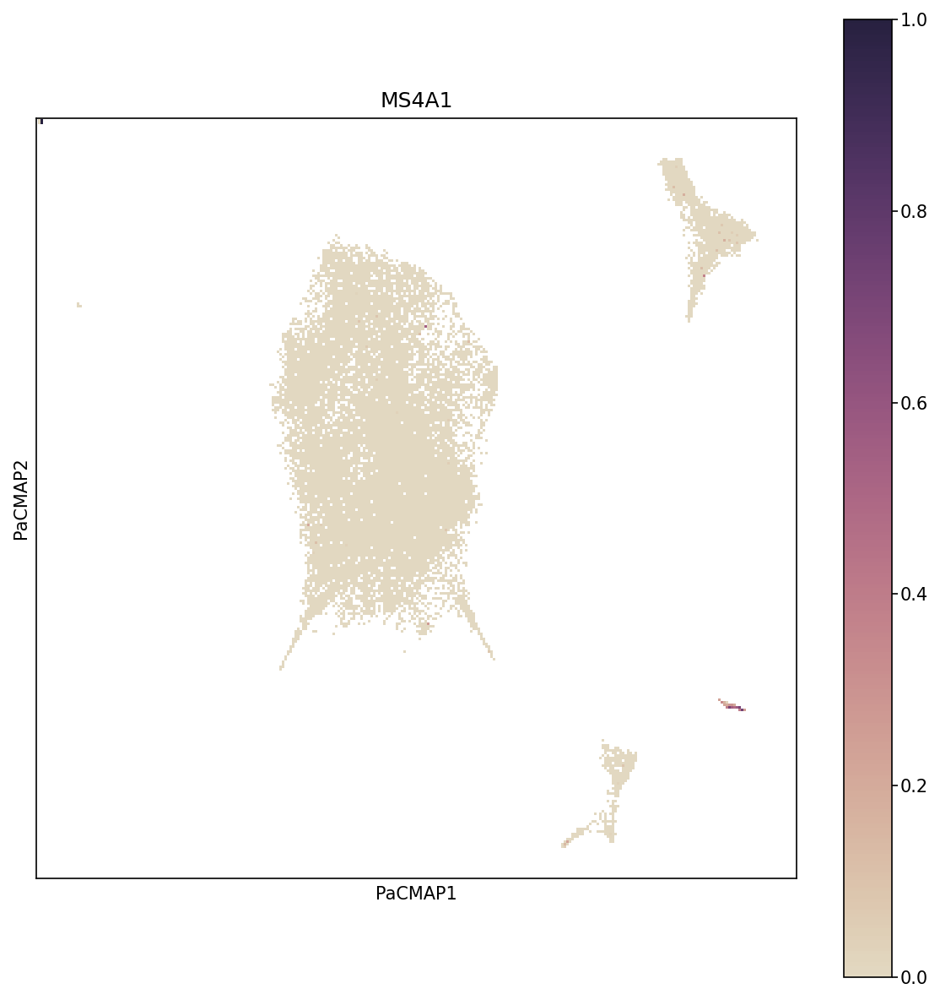
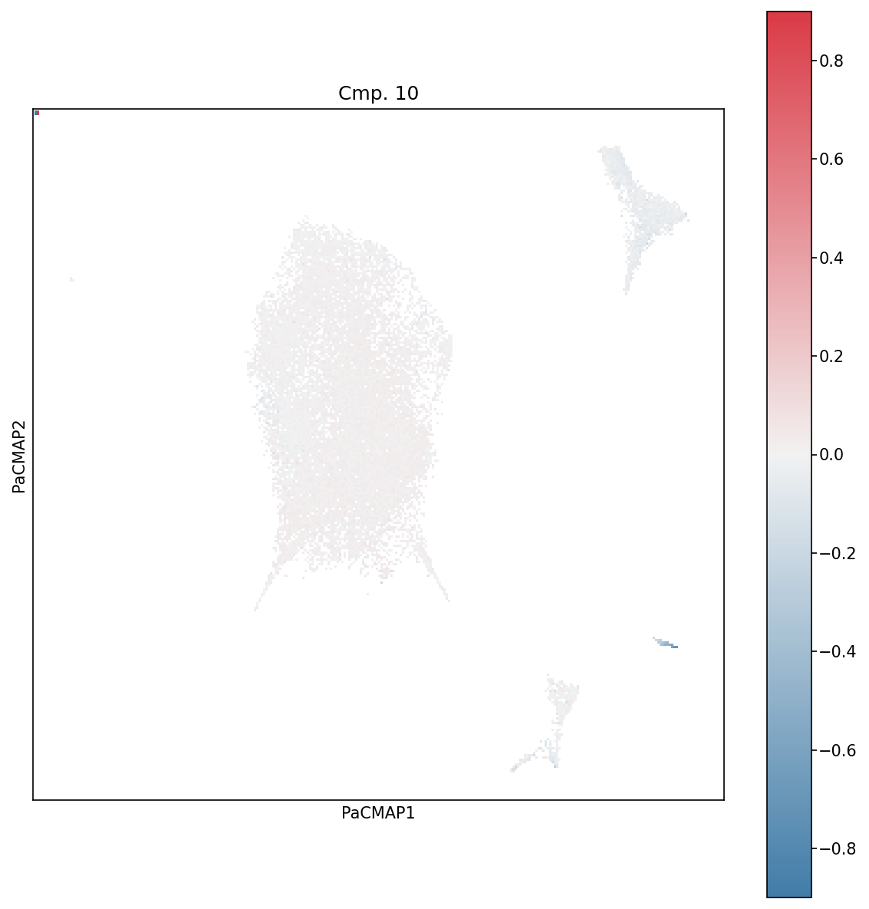

Tutorial for PARAFAC2-RISE on scRNA-seq Data
=============================================

This tutorial demonstrates the complete RISE workflow for analyzing single-cell RNA-seq data across experimental conditions.

Installation
------------

To add RISE to your Python package, add the following line to your ``requirements.txt`` and remake your virtual environment::

    git+https://github.com/meyer-lab/RISE.git@main

Preprocessing the Dataset
--------------------------

**Input Requirements**

Your AnnData object must meet the following requirements:

1. **Condition Index**: Include an observations column ``condition_unique_idxs`` that is a 0-indexed array indicating which condition each cell is derived from, along with the cell barcode. Condition 1 cells are indexed as 0, Condition 2 as 1, and so on.

2. **Preprocessing**: Your AnnData object must be preprocessed (doublets removed, genes filtered, normalized, and log-transformed) before running the algorithm. The ``prepare_dataset`` function can assist with preprocessing for gene filtering, normalization, and assigning ``condition_unique_idxs``.

**Using prepare_dataset**

The ``prepare_dataset`` function assists with preprocessing your data. Parameters:

- ``X``: AnnData object containing raw count data in sparse matrix format
- ``condition_name``: Name of the column in ``X.obs`` that specifies experimental conditions for each cell
- ``geneThreshold``: Minimum mean expression threshold for gene filtering (genes with mean expression below this value are removed)
- ``deviance``: If True, applies deviance transformation instead of log normalization (default: False)

The function performs the following steps:

- Filters cells with fewer than 10 total counts
- Filters genes based on the ``geneThreshold`` parameter
- Normalizes total counts per cell to the median
- Scales gene expression values
- Applies log₁₀((1000 × normalized_value) + 1) transformation (or deviance transformation if specified)
- Creates ``condition_unique_idxs`` column in ``X.obs`` with 0-indexed condition assignments
- Pre-calculates gene means and stores in ``X.var["means"]``

**Import and Prepare the Dataset**

Import your dataset as an AnnData object with preprocessed data.

Choosing the Rank
-----------------

**Assess Variance Explained by RISE and PCA**

Determine the optimal component/rank by plotting the variance explained (R²X) across different ranks for both RISE and PCA. This helps balance model complexity with explanatory power.

.. code-block:: python

    from RISE.plotting import plot_r2x
    import matplotlib.pyplot as plt

    ranks = [1, 5, 10, 15, 20, 25, 30]
    fig, ax = plt.subplots(figsize=(5, 5))

    plot_r2x(X, ranks, ax)
    plt.tight_layout()
    plt.show()

   
**Evaluate Factor Stability with Factor Match Score (FMS)**

Measure the reproducibility of the RISE factorization across different ranks. An FMS above ~0.6 indicates stable components.

.. code-block:: python

    from RISE.plotting import plot_fms_diff_ranks

    fig, ax = plt.subplots(figsize=(5, 5))
    rank_list = list(ranks)

    plot_fms_diff_ranks(X, ax, ranksList=rank_list, runs=3)
    plt.tight_layout()
    plt.show()

Running the Factorization
--------------------------

**Perform RISE Factorization**

Based on the variance explained and FMS, select a rank and perform the RISE factorization. This decomposes the data into condition, eigen-state, and gene factors.

.. code-block:: python

    from RISE.factorization import pf2

    rank = 20
    X = pf2(X=X, rank=rank, doEmbedding=True, tolerance=1e-9, 
            max_iter=500, random_state=42)

The function ``pf2`` performs PARAFAC2 tensor decomposition on the AnnData object. Parameters:

- ``X``: AnnData object with preprocessed scRNA-seq data
- ``rank``: Number of components to extract
- ``random_state``: Random seed for reproducibility (default: 1)
- ``doEmbedding``: If True, automatically computes PaCMAP embeddings of cell projections and stores in ``X.obsm["embedding"]`` (default: True)
- ``tolerance``: Convergence threshold for the optimization algorithm (default: 1e-9)
- ``max_iter``: Maximum number of iterations (default: 500)

The output of ``pf2`` includes the original AnnData object with added results and the reconstruction error (R²X). The following are added to the AnnData object:

- **Weights**: ``X.uns["Pf2_weights"]`` - The weights for each component
- **Condition Factors**: ``X.uns["Pf2_A"]`` - Factors with respect to conditions
- **Eigen-state Factors**: ``X.uns["Pf2_B"]`` - Eigen-state factors
- **Gene Factors**: ``X.varm["Pf2_C"]`` - Gene factors (matrix width equals the rank)
- **Projections**: ``X.obsm["projections"]`` - Cell projections for each component (matrix width equals the rank)
- **Weighted Projections**: ``X.obsm["weighted_projections"]`` - Weighted projections for each cell across all components, determining how each cell relates to each component pattern

Visualizing the Factors
------------------------

**Visualize Condition Factors**

Examine how each experimental condition contributes to the identified patterns. Log-transforming these factors allows for easier interpretation of condition-specific effects.
Several plotting functions are available in the ``RISE.plotting`` package.

.. code-block:: python

    from RISE.plotting import plot_condition_factors

    fig, ax = plt.subplots(figsize=(8, 8))

    plot_condition_factors(X, ax=ax, cond="Condition", log_transform=True)
    plt.tight_layout()
    plt.show()

   
   **Condition Factors Heatmap.** This heatmap shows how each experimental condition (rows) contributes to each component (columns). 

**Visualize Cell Embedding**

Explore the latent space of cells using nonlinear dimensionality reduction methods such as PaCMAP. Label cells by cell type or experimental condition to understand clustering patterns.

.. code-block:: python

    from RISE.plotting import plot_labels_pacmap

    fig, ax = plt.subplots(figsize=(8, 8))

    plot_labels_pacmap(X, labelType="Cell Type", ax=ax)
    plt.tight_layout()
    plt.show()

**Visualize Eigen-State Factors**

Analyze how each cell state contributes to the identified patterns. Each eigen-state represents a summary of similar cells with a distinct expression profile.

.. code-block:: python

    from RISE.plotting import plot_eigenstate_factors

    fig, ax = plt.subplots(figsize=(4, 4))

    plot_eigenstate_factors(X, ax=ax)
    plt.ylabel("Eigen-state")
    plt.tight_layout()
    plt.show()

   
   **Eigen-state Factors Heatmap.** This heatmap shows how each eigen-state (representing groups of similar cells) is related to each component. High values indicate strong association with a component.

**Visualize Gene Factors**

Identify which genes are highly weighted in each component, revealing coordinated gene modules. Adjust weight values to focus on genes that contribute significantly to the patterns.

.. code-block:: python

    from RISE.plotting import plot_gene_factors

    fig, ax = plt.subplots(figsize=(7, 8))

    plot_gene_factors(X, ax=ax, weight=0.2, trim=True)
    plt.tight_layout()
    plt.show()

   
   **Gene Factors Heatmap.** This heatmap shows which genes (rows) are associated with each component (columns). The weight parameter filters out genes with low contributions for easier interpretation.

Interpreting a Component
-------------------------

**Investigate Gene Associations for a Component**

Overlay specific gene expression on the cell embedding to see which cells express genes of interest for a particular component.

.. code-block:: python

    from RISE.plotting import plot_gene_pacmap

    fig, ax = plt.subplots(figsize=(8, 8))

    gene = "MS4A1"  # B cell marker
    plot_gene_pacmap(gene, X, ax=ax, clip_outliers=0.9995)
    plt.tight_layout()
    plt.show()

   
   **Gene Expression on PaCMAP.** This visualization overlays MS4A1 gene expression (a B cell marker) onto the PaCMAP embedding. Cells are colored by expression level, revealing which populations express the gene.

**Investigate Cell Associations for a Component**

Visualize how cells contribute to specific components using weighted projections, revealing subpopulations with distinct expression patterns.

.. code-block:: python

    from RISE.plotting import plot_wp_pacmap

    fig, ax = plt.subplots(figsize=(8, 8))

    plot_wp_pacmap(X, cmp=10, ax=ax, cbarMax=0.9)
    plt.tight_layout()
    plt.show()

   
   **Weighted Projections for Component 10.** This plot shows which cells contribute most strongly to component 10. Cells with high weighted projections (bright colors) are most representative of that component's pattern.
